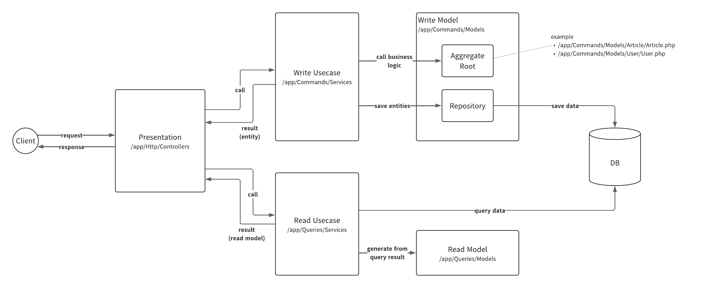

# Laravel + Simple Layered Architecture implementation of RealWorld app

[](https://github.com/yukicountry/realworld-laravel-layered-architecture/actions?query=branch%3Amain)
[](https://opensource.org/licenses/MIT)

## 💎Overview

Layered architecture is commonly used approach to build maintainable and robust application.

This app is aimed to show an example of simple layered architecture by utilizing Laravel framework functionalities.

## 🎈Getting started

### Local trial

```bash
# copy env
cp .env.example .env

# build
docker compose build --build-arg PUID=$(id -u) --build-arg PGID=$(id -g) app

# start
docker compose up -d

# install dependencies
docker compose exec app composer install

# generate app key
docker compose exec app php artisan key:generate

# db migration and seeding
docker compose exec app php artisan migrate --seed

# health check
curl localhost/api/health
# => OK
```

### Demo app

Public demo app is running on `https://realworld-backend-fvp4.onrender.com/api` .
You can freely make trial of this app.

The demo app is using [Render.com free plan](https://docs.render.com/free) , and there're some limitations as follows.

- First access may take up to a minute, because of service cold start.
- Database may be refreshed at some time (about once a month) without any announces.

## ⚙️How it works

### Structure overview

The overall structure is based on general layered architecture and CQRS approach.
In this project, read and write model refer to same database, and not event sourced.



|Role|Location|Description|
|----|----|----|
|Write Model|`app/Commands/Models`|Core logics and business rules for data creation, update, deletion|
|Write Usecase|`app/Commands/Services`|Write usecases such as `Register user`, `Update article` etc.|
|Read Model|`app/Queries/Models`|Defines data structures of query results|
|Read Usecase|`app/Queries/Services`|Query usecases such as `Search article by tag`, `Get user profile` etc.|
|Presentation Layer|`app/Http/Controllers`|Defines http api|
|Infrastructure Layer|`app/Implementations`|Concrete implementation of interface such as repositories or domain services defined in write model|

### Where are Eloquent Models?

Eloquent model is not used in this project.
It is easy to use, understandable and programmer friendly, but tend to have too many responsibilities and is difficult to read and test as system grows up.

The general responsibilities of Eloquent models are divided into some other modules as follows.

|Responsibility|Module|
|----|----|
|DB connection|Repository (in write model)|
|Business logics and rules|Aggregate root or entity (in write model)|
|Query logics|Read usecase|

Each modules have only single responsibility and they are easy to test!!🎉

### Tests

There are some sample unit and feature tests.

#### `app/Commands/Models/Article/ArticleTest.php`

sample tests for pure PHP class

#### `app/Queries/Services/ArticleQueryServiceTest.php`

sample tests for classes that needs to interact with external system or services (in this case, database)

#### `tests/Feature/RegistrationApiTest.php`

feature test sample

### Directory structure

```plaintext
.
├── app
│   ├── Auth               # authorization modules
│   ├── Commands
│   │   ├── Models         # write models (grouped by aggregates)
│   │   └── Services       # write usecases (grouped by aggregates)
│   ├── Http               # presentation layer
│   ├── Implementations    # infrastructure layer
│   ├── Providers
│   ├── Queries
│   │   ├── Models         # read models
│   │   └── Services       # read usecases
│   └── Shared             # shared basic modules
├── bootstrap
├── conf                   # deployment files for Render.com
├── config
├── database
├── docker                 # files to build docker images
├── docs                   # documents and related images
├── public
├── routes
├── scripts                # deployment files for Render.com
├── storage
└── tests
```
